# BMW OTA update UI

<!-- @import "[TOC]" {cmd="toc" depthFrom=1 depthTo=6 orderedList=false} -->

<!-- code_chunk_output -->

- [BMW OTA update UI](#bmw-ota-update-ui)
- [BMW OS8](#bmw-os8)
  - [① 更新ソフトのダウンロード](#-更新ソフトのダウンロード)
  - [② ダウンロード完了通知](#-ダウンロード完了通知)
  - [③ インストール通知](#-インストール通知)
  - [④ 更新内容の確認](#-更新内容の確認)
  - [⑤ 予約更新](#-予約更新)
  - [⑥ すぐに更新](#-すぐに更新)
  - [⑦ インストール完了](#-インストール完了)
  - [その他 OTA更新に関する問い合わせ](#その他-ota更新に関する問い合わせ)
- [BMW OS7 (メンテナンス中)](#bmw-os7-メンテナンス中)

<!-- /code_chunk_output -->

#  BMW OS8 

BMW OS8 のOTA更新方法の説明動画は以下
- [BMW Operating System 8 - Remote Software Upgrade Installation - BMW How-To - YouTube](https://www.youtube.com/watch?v=mME39cwPUHM)

## ① 更新ソフトのダウンロード 
- 車両利用している間にバックグラウンドでダウンロードされる
- ダウンロード開始操作は紹介なし
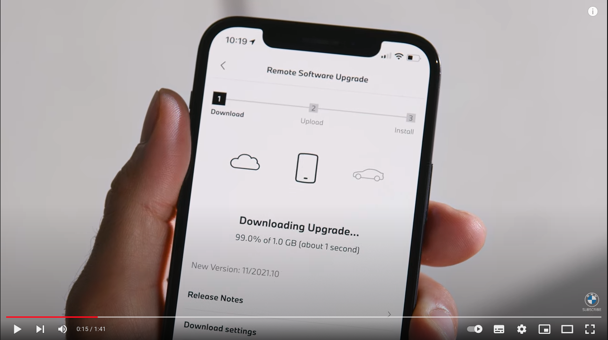

## ② ダウンロード完了通知
- ダウンロードの完了がMyBMWアプリに通知
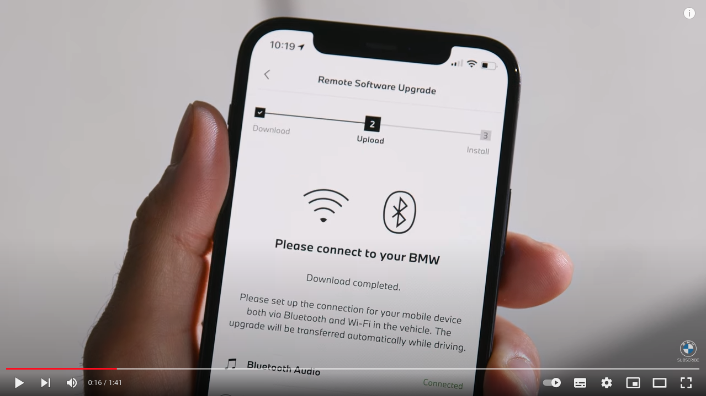
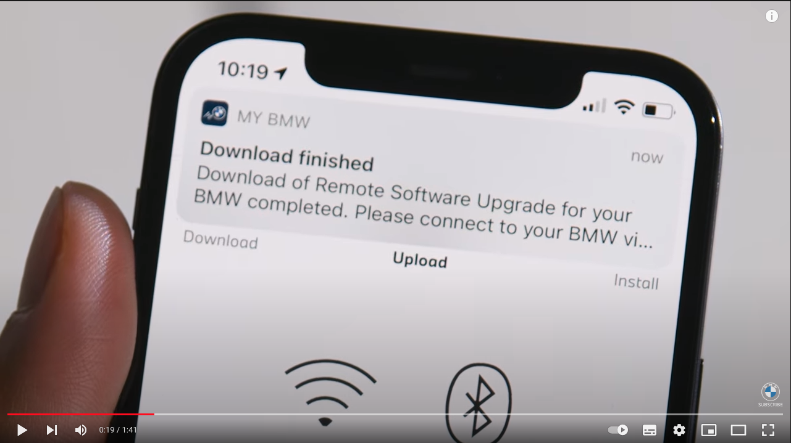

## ③ インストール通知
- ダウンロード完了後、車両を停止するとイントールを確認するメッセージが表示される
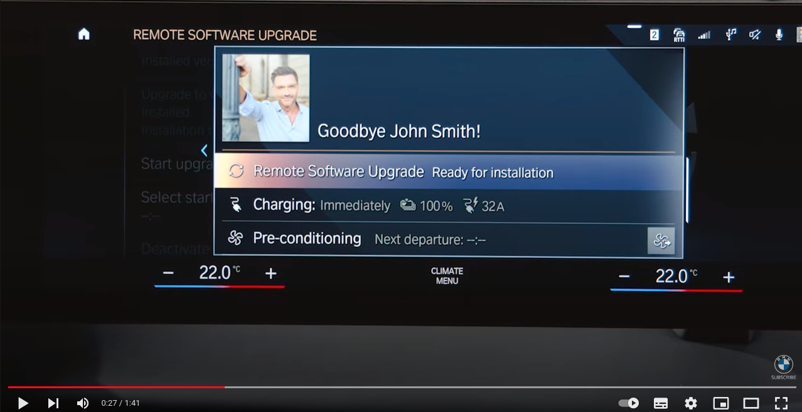
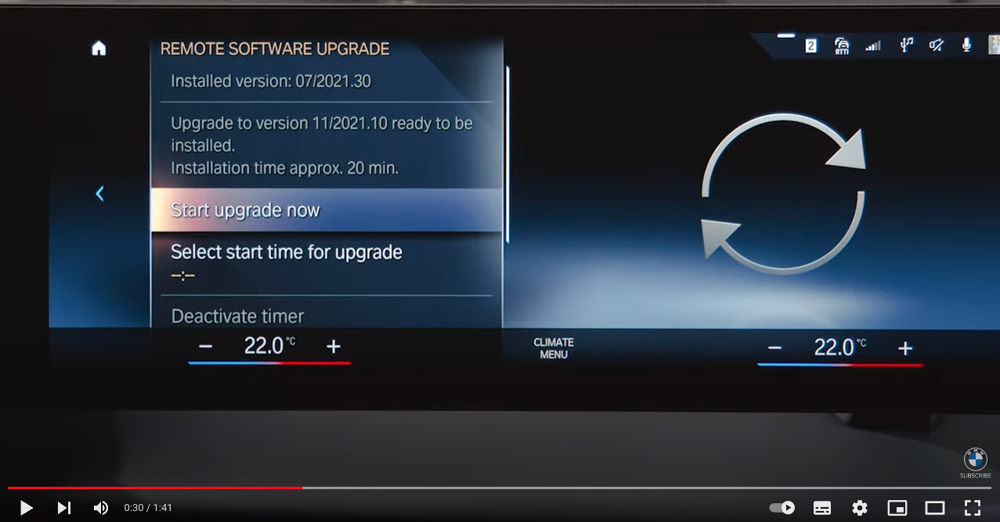

## ④ 更新内容の確認
- 更新内容を確認する場合は`"Info on version xxxx"`を選択
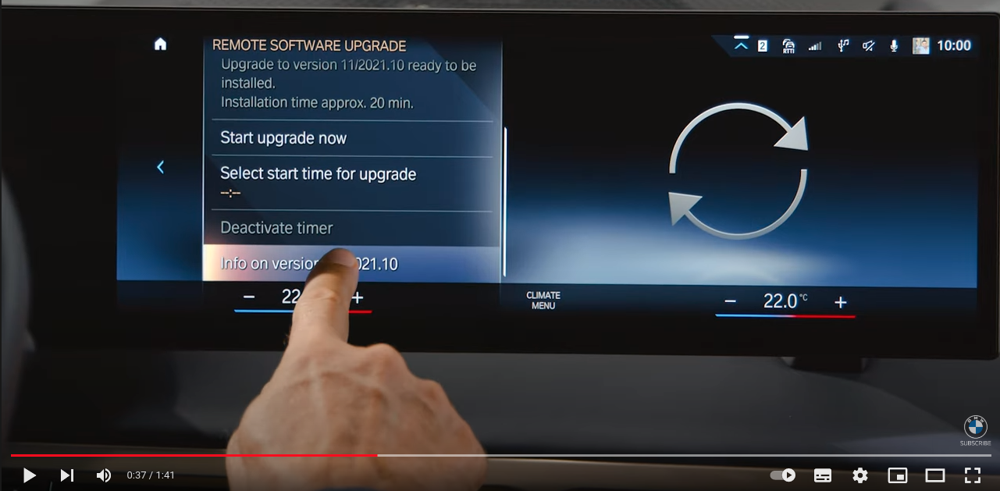

## ⑤ 予約更新
- すぐにインストールしない場合は、時間指定で予約が可能
- インストール中（約20分）は車両が利用できなくなる
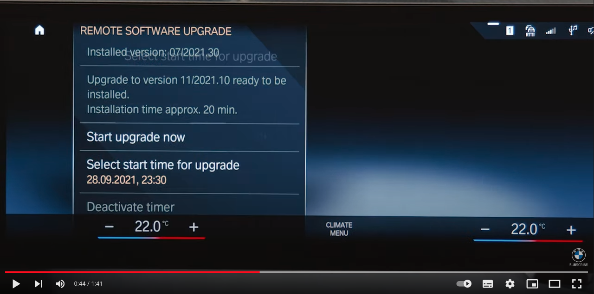
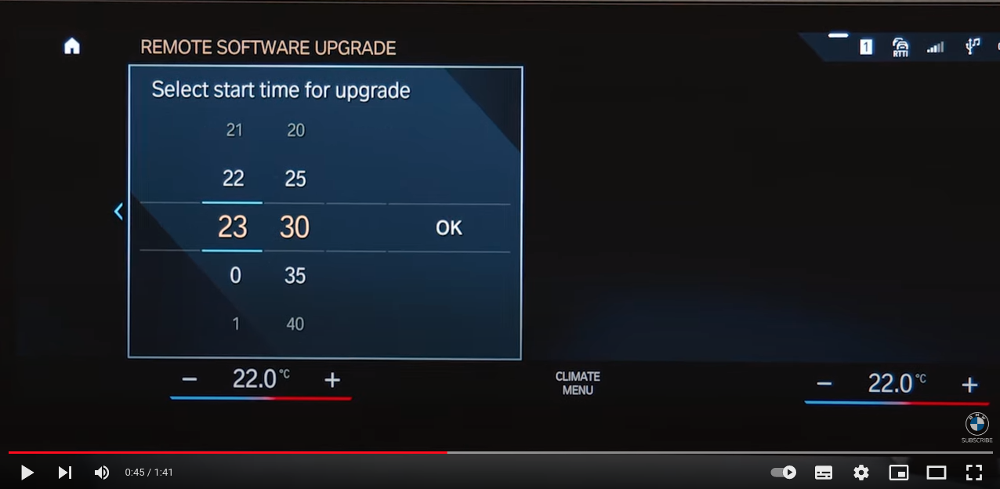
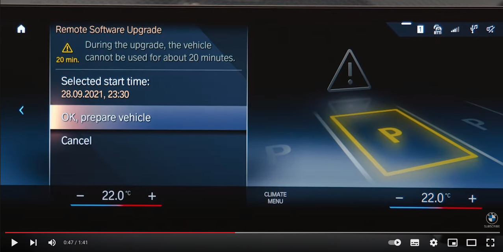

## ⑥ すぐに更新
- `"Start upgrade now"`を選択
  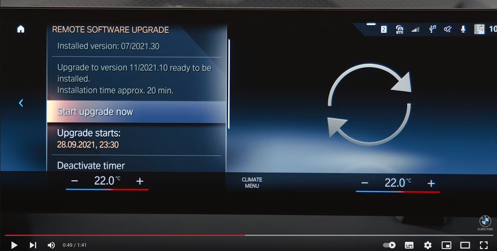
- 安全な場所に駐車し、`"OK, vehicle os parked sagety"`を選択
  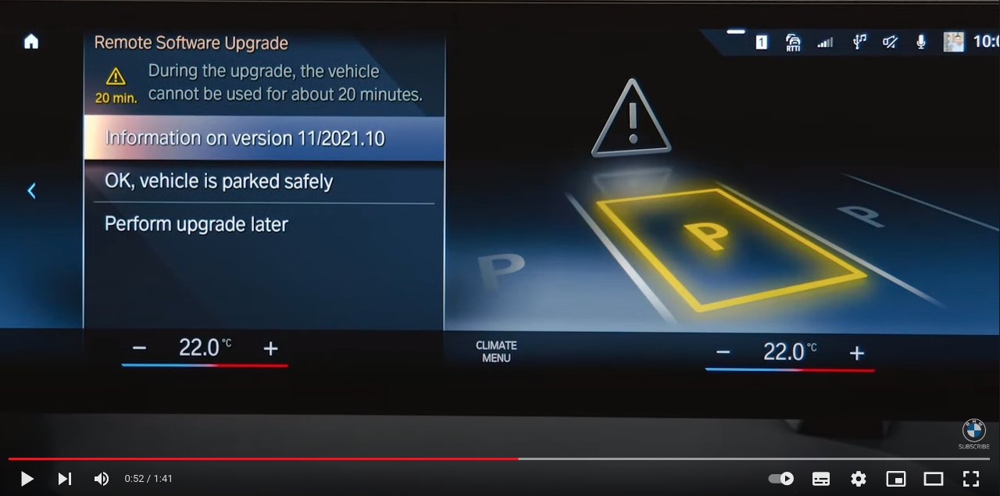
- `"Start upgrade now"`を選択
  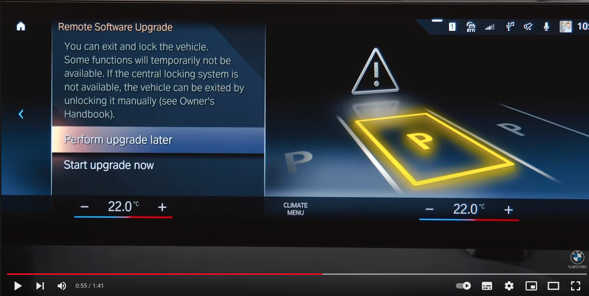
- インストールの注意事項が全て整っているかチェック
  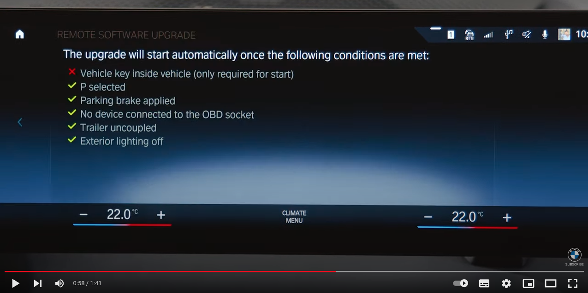
- 全てのチェックがOKになると、10秒後に更新が始まる
（ここでやっぱりとめたいときは`"Perform upgrade later"`を選択する）
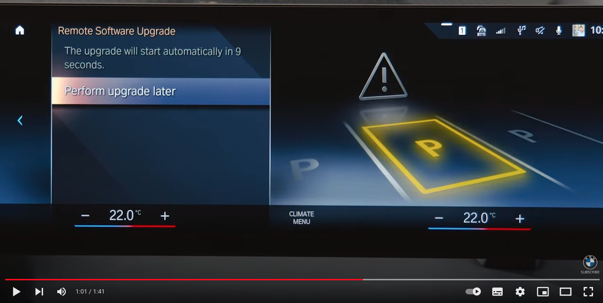

## ⑦ インストール完了
- MyBMWアプリに更新完了通知
- 走行前に車両のコントロールディスプレイにも表示される

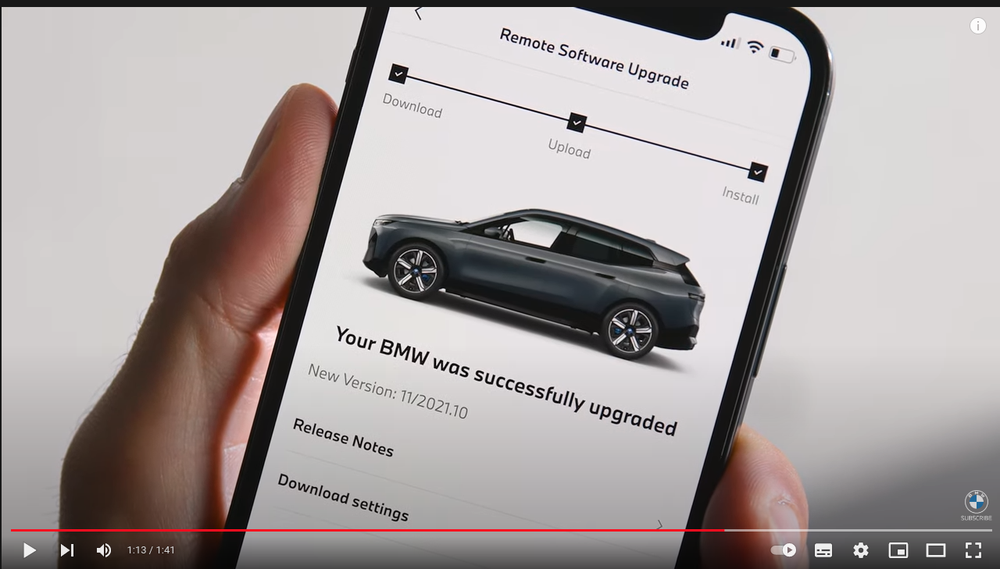

## その他 OTA更新に関する問い合わせ
- オペレータに接続し問い合わせ可能
- `"BMW Assistance APP"` > `"BMW Customer Support"`

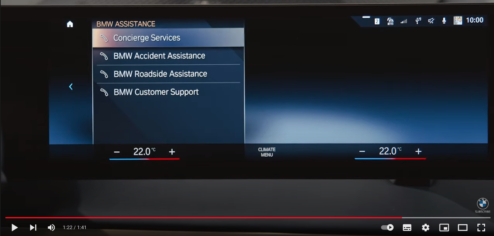
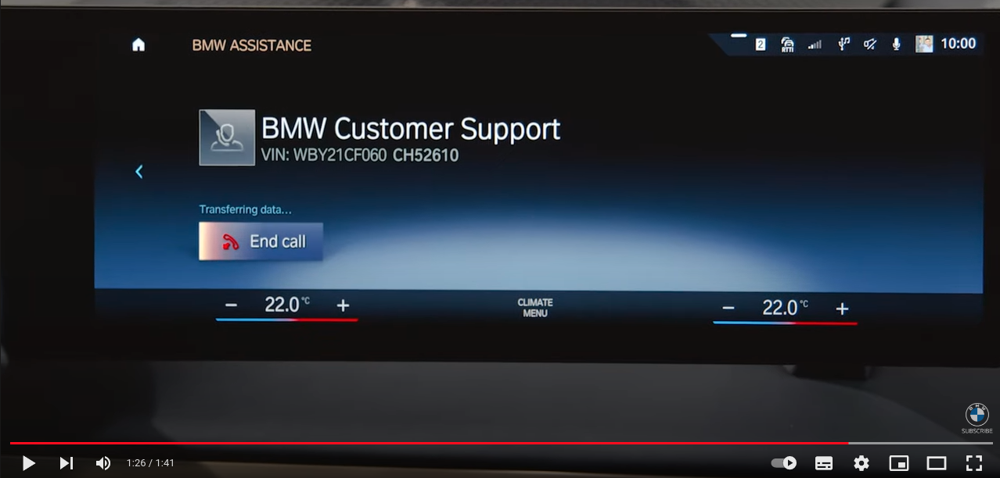

 

---

#  BMW OS7 (メンテナンス中)