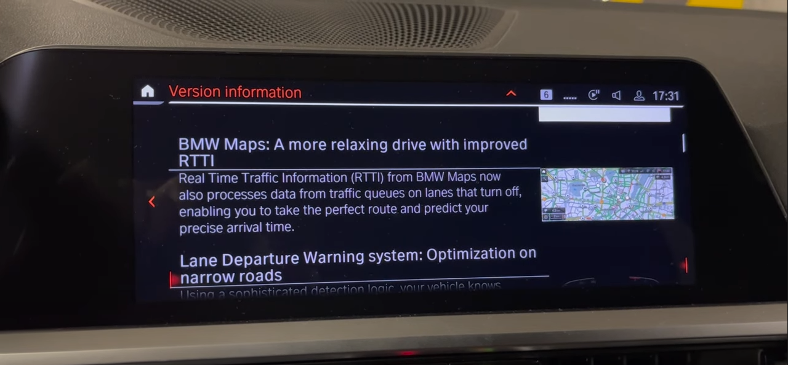

# BMW OTA update UI

<!-- @import "[TOC]" {cmd="toc" depthFrom=1 depthTo=6 orderedList=false} -->

<!-- code_chunk_output -->

- [BMW OTA update UI](#bmw-ota-update-ui)
- [HOW to Software Update](#how-to-software-update)
- [BMW OS8](#bmw-os8)
  - [① 更新ソフトのダウンロード](#1-更新ソフトのダウンロード)
  - [② ダウンロード完了通知](#2-ダウンロード完了通知)
  - [③ インストール通知](#3-インストール通知)
  - [④ 更新内容の確認](#4-更新内容の確認)
  - [⑤ 予約更新](#5-予約更新)
  - [⑥ すぐに更新](#6-すぐに更新)
  - [⑦ インストール完了](#7-インストール完了)
  - [その他 OTA更新に関する問い合わせ](#その他-ota更新に関する問い合わせ)
- [BMW OS7 (メンテナンス中)](#bmw-os7-メンテナンス中)
  - [更新方法](#更新方法)
  - [リリースノート [Version 21-07]](#リリースノート-version-21-07)

<!-- /code_chunk_output -->

# HOW to Software Update

- [Remote Software Upgrade: The Software Update from BMW | BMW.com.au](https://www.bmw.com/en-au/offers-and-services/bmw-digital-services-and-connectivity/remote-software-upgrade.html)

#  BMW OS8 

BMW OS8 のOTA更新方法の説明動画は以下
- [BMW Operating System 8 - Remote Software Upgrade Installation - BMW How-To - YouTube](https://www.youtube.com/watch?v=mME39cwPUHM)

## ① 更新ソフトのダウンロード 
- 車両利用している間にバックグラウンドでダウンロードされる

## ② ダウンロード完了通知
- ダウンロードの完了がMyBMWアプリに通知

## ③ インストール通知
- ダウンロード完了後、車両を停止するとイントールを確認するメッセージが表示される

## ④ 更新内容の確認
- 更新内容を確認する場合は`"Info on version xxxx"`を選択

## ⑤ 予約更新
- すぐにインストールしない場合は、時間指定で予約が可能
- インストール中（約20分）は車両が利用できなくなる

## ⑥ すぐに更新
- `"Start upgrade now"`を選択

- 安全な場所に駐車し、`"OK, vehicle os parked sagety"`を選択

- `"Start upgrade now"`を選択

- インストールの注意事項が全て整っているかチェック

- 全てのチェックがOKになると、10秒後に更新が始まる
（ここでやっぱりとめたいときは`"Perform upgrade later"`を選択する）

## ⑦ インストール完了
- MyBMWアプリに更新完了通知
- 走行前に車両のコントロールディスプレイにも表示される

## その他 OTA更新に関する問い合わせ
- オペレータに接続し問い合わせ可能
- `"BMW Assistance APP"` > `"BMW Customer Support"`

 

---

#  BMW OS7 (メンテナンス中)

## 更新方法

- **車載機版**

[How to start a Remote Software Upgrade – BMW How-To - YouTube](https://www.youtube.com/watch?v=N58Zjde3DNo)

[How to finish a Remote Software Upgrade – BMW How-To - YouTube](https://www.youtube.com/watch?v=4UEmTHtZdNw)

- ダウンロード完了後、アップグレード可能であることをスマホに通知
- ダウンロードはバックグラウンドで実施（pre-install）
- ダウンロードの進捗はナビメニューの「Remote Software Upgrade」から確認可能
- 更新が可能な状態で、IG-OFFするとアップグレードの案内通知がナビ画面に表示
- そこから選択していくと、条件を満たした場合に更新が始まる
- 更新中は車両使用不可
- 更新時間は約20分間
- 更新中のキャンセルは不可
- 電源供給が必要なデバイス（スマホなど）は更新前に外しておく
- 安全な場所に駐車されていること
- 更新中は乗っていてもいいし、車両から降りてロックしておくことも可能
- 更新完了するとスマホに通知がいく

## リリースノートの表示 [Version 21-07]

- **WEB版 Release Note**

[Remote Software Upgrade: The Software Update Upgrade 21-07 | BMW.co.za](https://www.bmw.co.za/en/topics/offers-and-services/bmw-digital-services-and-connectivity/remote-software-upgrade-21-07.html)

- **車載機版 Release Note**

WEB版と記載してある内容は変わらん

