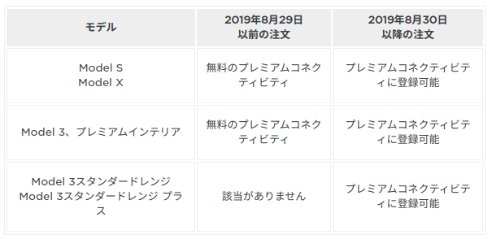
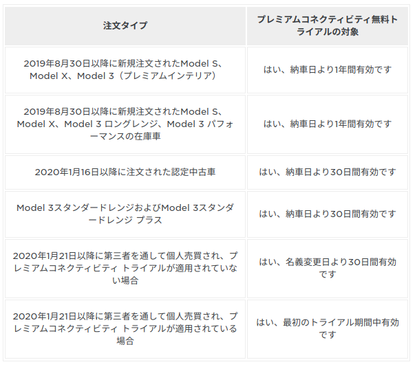

#  Tesla 

- [Tesla - US](https://www.tesla.com/?redirect=no)
- [Tesla - JP](https://www.tesla.com/ja_jp)

# サイト

- [Tesla Softwa Update History](https://www.notateslaapp.com/software-updates/history/)

# タイムライン

- 2020/11/13 : [米テスラ、リチウムイオン蓄電装置市場に参入(イスラエル) | ビジネス短信 - ジェトロ](https://www.jetro.go.jp/biznews/2020/11/248e7f3207b4ca33.html)

# まとめ

- OTA有無：○
- 通信契約：△（契約すればセルラー通信可能、Wifiでも可能）
- 契約による機能制限：なし
- 更新中の運転：不可 [*link](https://www.tesla.com/jp/support/software-updates)
- 更新キャンセル：不可 [*link](https://www.tesla.com/jp/support/software-updates)
- レジューム機能：あり [*link](https://www.tesla.com/jp/support/software-updates)
- 更新失敗時の対応：カスタマーサポートへ連絡
- ソフトウェアバージョン確認：センターディスプレイ（VIN番号も表示）
- 更新中の充電：不可（接続中であれば更新後自動充電）
- 更新中・更新後のタッチスクリーンの不具合時：タッチスクリーンの再起動 [*link](https://www.tesla.com/jp/support/software-updates)
- 

# Connectivity

- [Connectivity | Tesla](https://www.tesla.com/support/connectivity?redirect=no)
- [コネクティビティ | テスラジャパン](https://www.tesla.com/jp/support/connectivity?redirect=no)

コネクティビティ パッケージ

|項目                      |スタンダード|プレミアム|
|:--:                      |:--:        |:--:      |
|ナビゲーション            | ○         | ○       |
|交通情報リアルタイム更新　| -          | ○       |
|衛生画像地図              | -          | ○       |
|動画ストリーミング        | Wi-Fi      | ○       |
|カラオケ(アジア圏以外)    | Wi-Fi      | ○       |
|音楽ストリーミング        | Wi-Fi      | ○       |
|インターネットブラウザ    | Wi-Fi      | ○       |
|
|価格                      | 無料       | 990円/月 |

- プレミアムインテリア装備のModel S、Model X、Model 3には、納車日から1年間プレミアムコネクティビティの無料トライアルが提供される
- Model 3スタンダードレンジおよびModel 3スタンダードレンジ プラスには納車時から30日間プレミアムコネクティビティの無料トライアルが提供される
- プランによるAuoPilotへの影響はない。Wi-Fiでソフトウェア更新するか、セルラー通信で更新できるかの違い。

プレミアムコネクティビティの対象車両

- 2020年1月15日以前に購入されたTeslaの認定中古車両については、車が有効である限り、引き続き上記のプレミアムコネクティビティ機能を無料でご利用いただけます。個人で車両を他人に販売する場合、将来のオーナー様にもご利用いただけます。
- 2020年1月20日までに個人間または第三者経由で購入されたテスラ車については、車が有効である限り、プレミアムコネクティビティ機能を無料でご利用いただけます。
- 2020年1月21日以降に個人間または第三者経由で購入されたテスラ車については、プレミアムコネクティビティが適用されない場合、または有効なプレミアムコネクティビティ トライアルが適用されていない場合には、登録の対象になる前に30日間のプレミアムコネクティビティ トライアルが提供されます。2020年1月21日以降に個人間または第三者経由で購入されたテスラ車については、プレミアムコネクティビティが適用されない場合、または有効なプレミアムコネクティビティ トライアルが適用されていない場合には、登録の対象になる前に30日間のプレミアムコネクティビティ トライアルが提供されます。

# Software Update

- [Software Updates | Tesla](https://www.tesla.com/support/software-updates)

# Model 3

- プレミアムコネクティビティ加入
  - 交通状況のリアルタイム更新される地図とナビゲーション
  - 新車購入後30日間無料（パーシャル プレミアム インテリア）
  - 新車購入後1年間無料（プレミアム インテリア）
  - 990円/月
  - 加入有無による自動運転機能への影響はない

- オートパイロット（標準）
  - 同一車線内の運転支援
  - 対車両・歩行者
  - TLA/TDA
  - ACC

- 完全自動運転（opt: ¥871,000）
  - オートパーキング（縦列、並列）
  - Upcomming：
    - サモン（自動出庫機能）
    - ナビゲート オン オートパイロット（高速道路自動運転機能、IC走行、追い越し）
    - 信号・標識認識＋停止制御
    - 市街地自動運転
  - ※納車後の購入：¥----（最新情報調査中）

