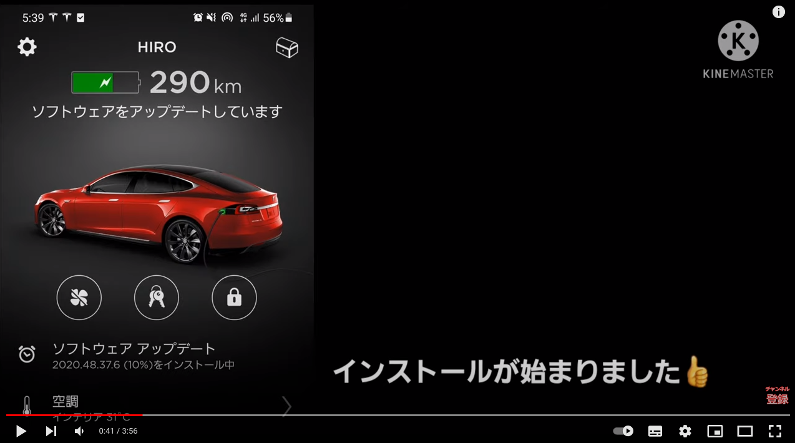
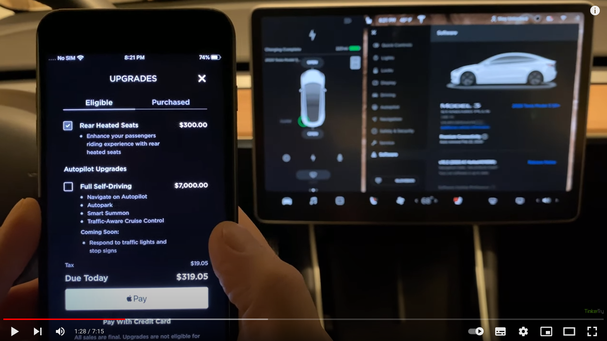
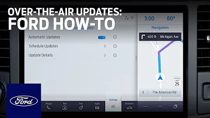
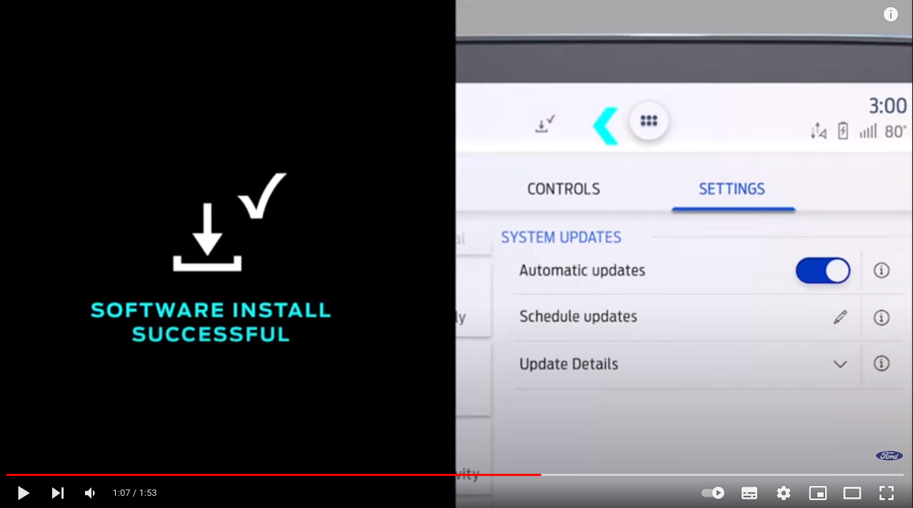

# OTA Software Update UI

<!-- @import "[TOC]" {cmd="toc" depthFrom=1 depthTo=6 orderedList=false} -->

<!-- code_chunk_output -->

- [OTA Software Update UI](#ota-software-update-ui)
- [Tesla](#tesla)
  - [スマホでのOTA更新](#スマホでのota更新)
  - [追加機能の購入とOTA更新](#追加機能の購入とota更新)
- [Ford](#ford)
  - [マルチメディア（SYNC3）のOTA更新](#マルチメディアsync3のota更新)
  - [制御ソフトウェアのOTA更新](#制御ソフトウェアのota更新)

<!-- /code_chunk_output -->

# Tesla

## スマホでのOTA更新

- Model-S P85D
- [Version 2020.48.37.6（Minor bug Fixes）](https://www.notateslaapp.com/ja/%E3%82%BD%E3%83%95%E3%83%88%E3%82%A6%E3%82%A7%E3%82%A2%E3%82%A2%E3%83%83%E3%83%97%E3%83%87%E3%83%BC%E3%83%88/%E3%83%90%E3%83%BC%E3%82%B8%E3%83%A7%E3%83%B3/2020.48.37.6/%E3%83%AA%E3%83%AA%E3%83%BC%E3%82%B9%E3%83%8E%E3%83%BC%E3%83%88)
- Update tiem : 50 min (display) → about 18 min (actual)

## 追加機能の購入とOTA更新

- Upgrade additional feature
- Rear Heated Steats : $300 
- Full Self-Driving : $7,000

# Ford

## マルチメディア（SYNC3）のOTA更新

- Ford F-150
FordPass Connectサービスを利用し、車載器通信機もしくはwifiで更新

## 制御ソフトウェアのOTA更新

- Mustang Mach-e
  制御ソフトの更新が可能となってもマルチメディアのOTA更新と操作は同様の模様。

