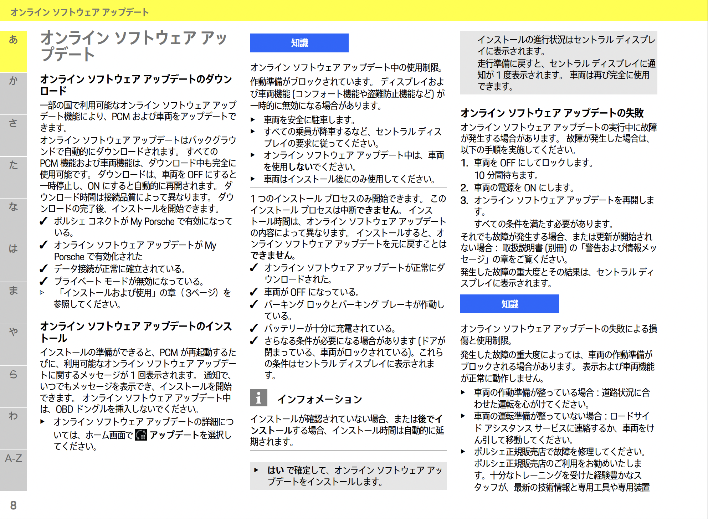

# 覚書用Note

Farizon Auto / Geely傘下 / EV track
[Geely's Farizon Auto unveils 'Homtruck' electric semi for global market in 2024 - Electrek](https://electrek.co/2021/11/09/geelys-farizon-auto-unveils-homtruck-electric-semi-for-global-market-in-2024/)

VWのソフトウェア会社CARIADがシステムを構築している
[Volkswagen Electric Vehicles Going "Over The Air" - CleanTechnica](https://cleantechnica.com/2021/07/08/volkswagen-electric-vehicles-going-over-the-air/)

VW / CARIAD / OTA
[First Over The Air Updates](https://cariad.technology/content/digitalmindofmobility/de/en/news/news/first-over-the-air-updates.html)

## Pole-Star

- [Updates Fahrzeug + Android Automotive (Wiki) - Polestar Wiki / Polestar 2 - Polestar Club](https://polestar.fans/t/updates-fahrzeug-android-automotive-wiki/5276)
- [Software updates | release note - polestar officail ](https://www.polestar.com/us/manual/polestar-2/2021/article/softwareUpdates/)

## Porsche Software Update

[Taycan-Good-to-know-.pdf](https://connect-store-static01.porsche.com/medias/Taycan-Good-to-know-.pdf?context=bWFzdGVyfGFzc2V0c3w2NDYyMzh8YXBwbGljYXRpb24vcGRmfGFzc2V0cy9oMjEvaDYxLzg4NDk1NDU4NTUwMDYucGRmfGUzZDQ0YTI0YWM2MmE1YjRkNDFhZjI2NGU4OWJmNTMyM2UwN2RkOThlMTRmNDczMGIwN2VhMWMzNzlkM2RjNGE)

[いつでも最新モデルに更新!? ポルシェのEV「タイカン」の無料アップデート開始 | VAGUE(ヴァーグ)](https://kuruma-news.jp/vague/post/44443)

[ポルシェ「タイカン」にソフトウェア・アップデート提供 音楽に合わせた室内照明も 米国 | SlashGear Japan](https://slashgear.jp/cars/18632/)
> 今回のアップデートの欠点は、そのアクセス方法です。タイカンはモデムが内蔵されたコネクテッドカーですが、今回の新しいファームウェアはOTA（無線）では配信されません。ディーラーに持ち込んでインストールしてもらう必要があり、ポルシェによれば完了までに2営業日かかるといいます。